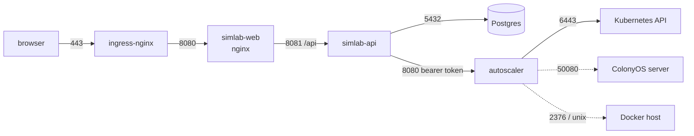

# Ports, dependencies, and what must not be buffered

## Who talks to whom

Solid lines are always present. Dotted lines exist only when a target of that
kind has been registered.

## Ports

| Service | Port | Protocol | Reached by |
|---|---|---|---|
| simlab-web | 8080 | HTTP | the ingress |
| simlab-api | 8081 | HTTP | simlab-web only |
| autoscaler | 8080 | HTTP | simlab-api only |
| Postgres | 5432 | TCP | simlab-api only |

Only simlab-web needs to be reachable from outside the namespace. The other
three are ClusterIP and should stay that way; if the cluster runs
NetworkPolicies, the table above is the whole allow-list.

## One origin, on purpose

simlab-web's nginx serves the app *and* proxies `/api` to simlab-api, so the
browser sees a single origin. That means no CORS configuration on the backend,
no API hostname baked in at build time, and an event stream that is not a
cross-origin request. One ingress rule, `/` to simlab-web, is all that is
needed.

## The event stream, and what breaks it

`GET /api/runs/{id}/events` and `GET /api/events` are Server-Sent Events: a
single response that stays open for the life of a run, delivering each cycle
as it happens.

Three things along the path will quietly break it, and all three are already
handled in this project's own manifests — but an infra repo that re-templates
them needs to carry them across:

| What | Where | Symptom if missed |
|---|---|---|
| `proxy_buffering off` | simlab-web's nginx, and the ingress annotation `nginx.ingress.kubernetes.io/proxy-buffering: "off"` | The run appears frozen, then everything arrives at once when it finishes |
| A long read timeout | ingress annotation `nginx.ingress.kubernetes.io/proxy-read-timeout: "86400"` | The stream dies every 60 seconds and the page reconnects continually |
| No write timeout on the server | simlab-api sets none, deliberately | Every watcher severed on a fixed schedule |

The application is built to survive all three failing — a client that
reconnects re-reads the run's cycles from the database — so the symptom is a
UI that feels broken rather than data that is lost. That makes it the kind of
thing nobody notices for a long time, which is why it is written down here.

## Outbound

The autoscaler makes outbound connections determined entirely by which targets
have been registered:

- **Kubernetes API** of whichever cluster a `kubernetes` or `colonyos-k8s`
  target names. In-cluster targets use the mounted ServiceAccount and reach
  `kubernetes.default.svc`; external clusters need whatever egress the
  cluster's policy allows.
- **ColonyOS server**, default port 50080, for `colonyos-*` targets.
- **A Docker daemon**, over a unix socket or TCP 2376, for
  `colonyos-container` targets. A unix socket means a hostPath mount, which is
  a privileged arrangement and the infrastructure repository's decision to
  make or refuse.

None of these are needed for simulation runs, which reach nothing.

## Health

| Endpoint | Service | What it means |
|---|---|---|
| `/healthz` | all three | The process is alive. Unauthenticated on the autoscaler — a kubelet cannot carry a credential, and requiring one would get the pod killed for being unauthenticated rather than unhealthy |
| `/readyz` | autoscaler, simlab-api | Ready to serve. simlab-api's also pings Postgres and reports how many runs are in flight |
| `/healthz` | simlab-web | nginx is serving; it says nothing about the backend, deliberately, so a backend restart does not take the frontend out of the load balancer too |
